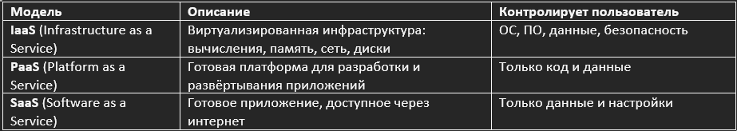
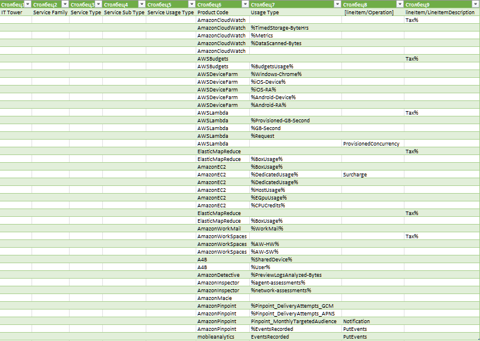

Лабораторная работа 1. Знакомство с IaaS, PaaS, SaaS сервисами в облаке на примере Amazon Web Services (AWS). Создание сервисной модели.

Вариант 4 - выбрали рандомом

Цель работы: Знакомство с облачными сервисами. Понимание уровней абстракции над инфраструктурой в облаке. Формирование понимания типов потребления сервисов в сервисной-модели. 
Дано: 
Слепок данных биллинга от провайдера после небольшой обработки в виде SQL-параметров. Символ % в начале/конце означает, что перед/после него может стоять любой набор символов.
Образец итогового соответствия, что желательно получить в конце. В этом же документе  
Необходимо: 
Импортировать файл .csv в Excel или любую другую программу работы с таблицами. Для Excel делается на вкладке Данные – Из текстового / csv файла – выбрать файл, разделитель – точка с запятой.
Распределить потребление сервисов по иерархии, чтобы можно было провести анализ от большего к меньшему (напр. От всех вычислительных ресурсов Compute дойти до конкретного типа использования - Выделенной стойка в датацентре Dedicated host usage).
Сохранить файл и залить в соответствующую папку на Google Drive.

Алгоритм работы: Сопоставить входящие данные от провайдера с его же документацией. Написать в соответствие колонкам справа значения 5 колонок слева, которые бы однозначно классифицировали тип сервиса. Для столбцов IT Tower и Service Family значения можно выбрать из образца.

Выполнение:

Облачные вычисления строятся на трёх ключевых моделях:

Методология выполнения:

Исходные данные - файл, содержащий строки биллинга AWS с полями:

Product Code — идентификатор AWS-сервиса
Usage Type — тип потребления ресурса (с wildcard %)
lineItem/Operation и lineItem/LineItemDescription — вспомогательные поля
Используя официальную документацию AWS, каждая строка была классифицирована по 5-уровневой таксономии:

IT Tower — высший функциональный уровень (например, Compute, Security)
Service Family — категория внутри башни (например, Serverless, Virtual Machines)
Service Type — конкретный AWS-сервис (например, AWS Lambda)
Service Sub Type — режим или тип использования (например, Provisioned Concurrency)
Service Usage Type — детальный тип потребления (например, GB-Second)

Результат:
Все строки из исходного CSV были однозначно сопоставлены.

Полная таблица представлена в прилагаемом файле.

Вывод:

-Изучены ключевые модели облачных сервисов.
-Проведена детальная классификация AWS-сервисов по иерархии.
-Создана структурированная модель, пригодная для анализа затрат и оптимизации.
