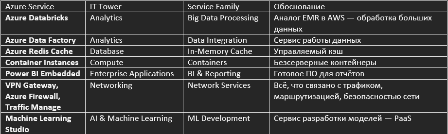
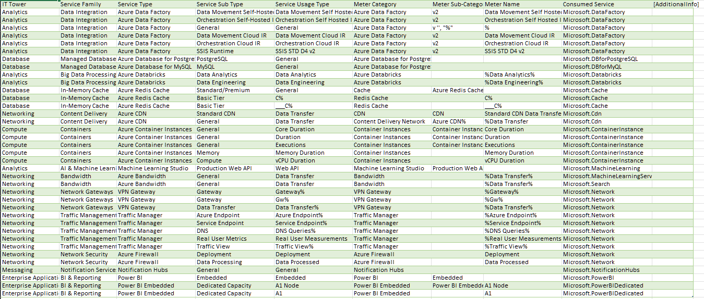

Лабораторная работа 2. Сравнение сервисов Amazon Web Services и Microsoft Azure. Создание единой кросс-провайдерной сервисной модели.

Цель работы: Получение навыков аналитики и понимания спектра публичных облачных сервисов без привязки к вендору. Формирование у студентов комплексного видения Облака. 

Дано: 

Данные лабораторной работы 1.

Слепок данных биллинга от провайдера после небольшой обработки в виде SQL-параметров. Символ % в начале/конце означает, что перед/после него может стоять любой набор символов.

Образец итогового соответствия, что желательно получить в конце. В этом же документе 

Необходимо: 

Импортировать файл .csv в Excel или любую другую программу работы с таблицами. Для Excel делается на вкладке Данные – Из текстового / csv файла – выбрать файл, разделитель – точка с запятой.

Распределить потребление сервисов по иерархии, чтобы можно было провести анализ от большего к меньшему (напр. От всех вычислительных ресурсов Compute дойти до конкретного типа использования - Выделенной стойка в датацентре Dedicated host usage). При этом сохранять логическую концепцию, выработанную в Лабораторной работе 1.

Сохранить файл и залить в соответствующую папку на Google Drive.

Алгоритм работы: Сопоставить входящие данные от провайдера с его же документацией. Написать в соответствие колонкам справа значения 5 колонок слева, которые бы однозначно классифицировали тип сервиса. Для столбцов IT Tower и Service Family значения можно выбрать из образца. В ходе выполнения работы не отходить от принципов классификации, выбранных в Лабораторной работе 1. Например, если сервис Машинного обучения был разбит на Вычислительные мощности и Облачные сервисы, то продолжать его разбивать и в новых данных.

Выполнение:

Начальная таблица

Методология

Мы сохранили ту же иерархию, что и в ЛР-1:

IT Tower — функциональная башня (например, Compute, Database, Networking)

Service Family — подкатегория (например, Virtual Machines, Serverless, Managed DB)

Service Type — конкретный сервис (например, Azure Databricks, Azure Redis Cache)

Service Sub Type — режим или тип ресурса (например, Data Engineering, Standard Tier)

Service Usage Type — детальное измерение (например, vCPU Duration, Data Transfer)

Классификация Azure-сервисов выполнена на основе:

-Официальной документации Microsoft Azure

-Аналогии с AWS-сервисами (например, Azure Databricks ↔ Amazon EMR)

-Сохранения логики из ЛР-1 

Классификация

P.S.

Учитывая специфику и рост AI-сервисов, мы выделили новую башню AI & Machine Learning, но только там, где это оправдано (например, dedicated ML inference)

Результат:

Создан единый классификационный каркас, позволяющий:

-Сравнивать затраты на Compute в AWS и Azure

-Анализировать потребление Managed Databases независимо от провайдера

-Группировать все Data Transfer в единую категорию для расчёта сетевых расходов

Создана единая модель классификации облачных сервисов

Итоговая таблица(Также она представлена в формате xlsx):

